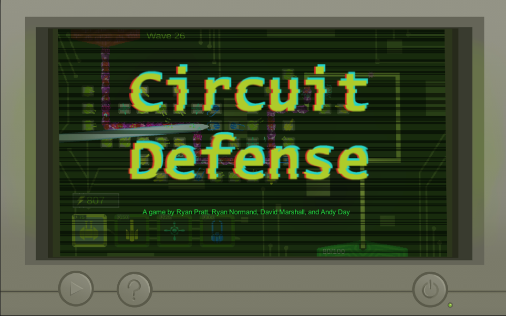

# CircuitBoardTowerDefense

## Description
A single player Strategy Game where you're trying to defend your Motherboard from viruses using Towers and other defenses.

## Controls
 
Use the Left Mouse Button to select and place Towers.
Use the Spacebar to Call the next Wave.

Special Features: Enemies will drop Microchips that can be picked up and installed onto your Towers, increasing their effectiveness in different ways.

## Novelty
All Assets were made by the team.

## Team Members 
 * David Marshall 
 * Ryan Pratt
 * Ryan Normand
 * Andy Day